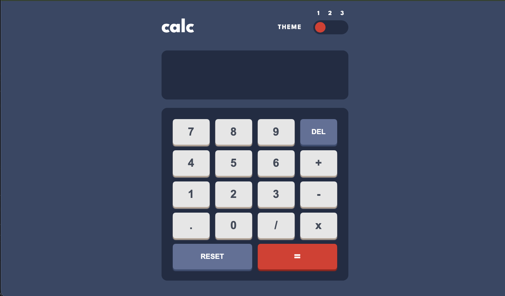
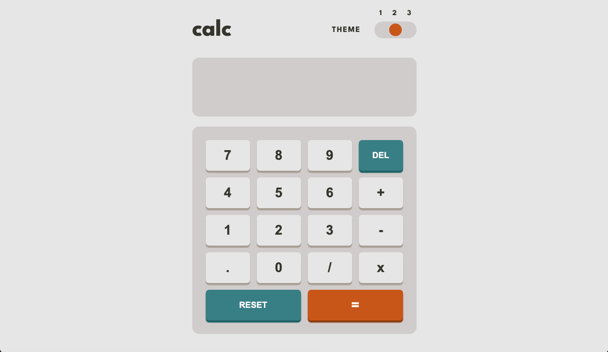
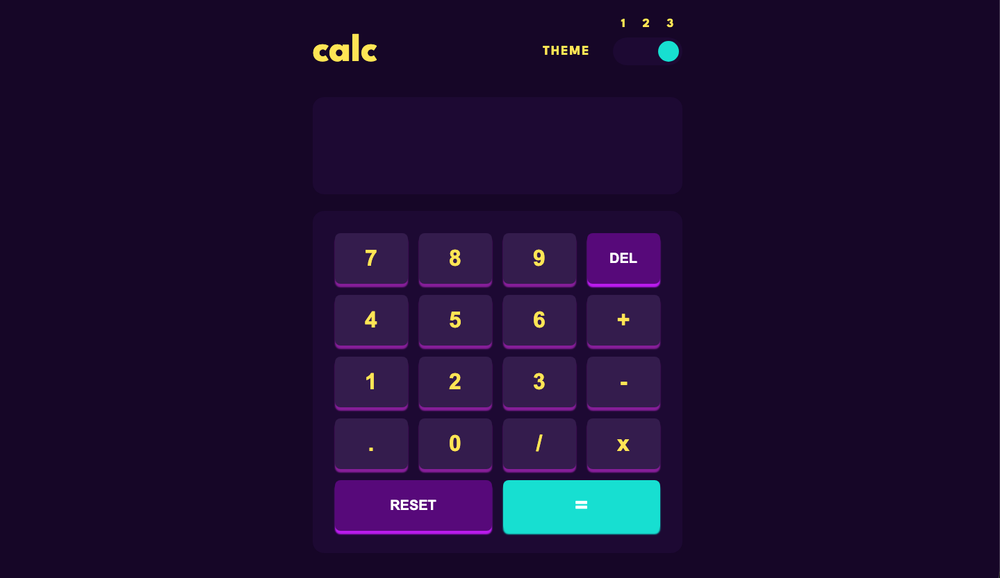
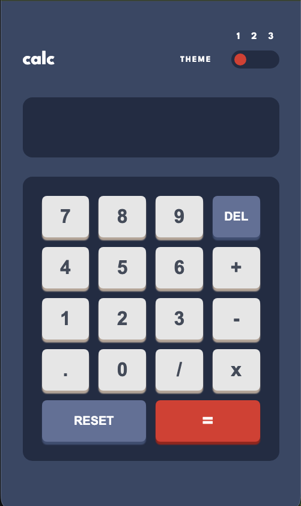

# Frontend Mentor - Calculator app solution

This is a solution to the [Calculator app challenge on Frontend Mentor](https://www.frontendmentor.io/challenges/calculator-app-9lteq5N29).

## Table of contents

- [Frontend Mentor - Calculator app solution](#frontend-mentor---calculator-app-solution)
  - [Table of contents](#table-of-contents)
  - [Overview](#overview)
    - [The challenge](#the-challenge)
    - [Screenshot](#screenshot)
    - [Links](#links)
  - [My process](#my-process)
    - [Built with](#built-with)
    - [What I learned](#what-i-learned)
  - [Author](#author)

## Overview

### The challenge

Users should be able to:

- See the size of the elements adjust based on their device's screen size ✅
- Perform mathmatical operations like addition, subtraction, multiplication, and division ✅
- Adjust the color theme based on their preference ✅
- Have their initial theme preference checked using `prefers-color-scheme` and have any additional changes saved in the browser ✅

### Screenshot

### Links

<!-- - Solution URL: [Add solution URL here](https://your-solution-url.com) -->

- [Live Site URL](https://calc-e3pg.onrender.com/)
- [Githib URL](https://github.com/prabhashranjaner/FEM_Calculator)

## My process

### Built with

- Semantic HTML5 markup
- CSS custom properties
- Flexbox
- CSS Grid
- Mobile-first workflow
- React with **useReducer**

### What I learned

**Three-way-toggle Switch**

At first it looked easy. I knew how to make two way custom swich. But this was very challenging. With some effort I think I did great.

**State management with useReducer**

## Author

<!-- - Website - [Add your name here](https://www.your-site.com) -->

- Frontend Mentor - [@prabhashranjaner](https://www.frontendmentor.io/profile/prabhashranjaner)
- X - [@prabhash\_\_dev](https://x.com/prabhash__dev)
